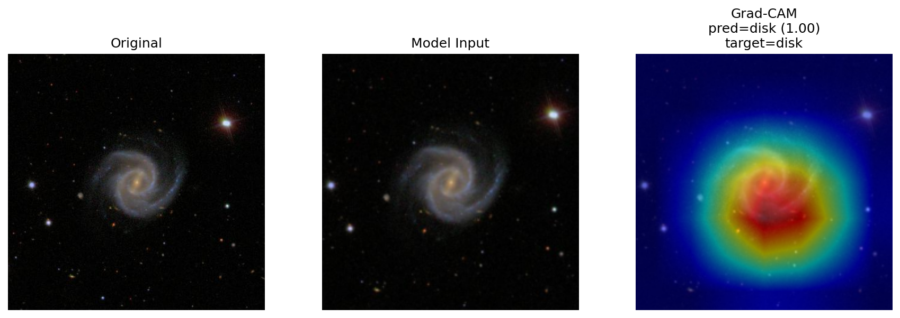

# Galaxy Classifier

A deep learning project for classifying galaxy images using a two-stage image classification pipeline built with PyTorch.

The project trains and evaluates multiple CNN architectures on Galaxy Zoo 2 data and includes tooling for dataset preparation, model training, evaluation, explainability (Grad-CAM), and deployment workflows.

These models are currently trained and deployed as part of an automated machine learning workflow on AWS SageMaker
A demo of these models can be found on https://machine-learning-demos.com



## Project Overview

The classifier uses a two-stage architecture to determine whether an image is a galaxy and it's morphology.

### Stage 1 - Galaxy Detection

Determine whether an image contains a galaxy or non-galaxy object.
Classes:
* galaxy
* other

### Stage 2 - Galaxy Morphology

For images identified as galaxies, classify morphology:

* elliptical
* disk

---

# Model Architectures

The project compares two different architectures:

ResNet18
* Transfer learning using a pretrained convolutional model
* Strong baseline for image classification
* Performs best on morphology classification

GalaxyCNN
* Custom CNN designed specifically for the dataset
* Lightweight architecture
* Useful for comparison against transfer learning

# Explainability with Grad-CAM

The repository includes Grad-CAM utilities to visualize which regions of the image influenced the model prediction.

Grad-CAM overlays help validate that the model is focusing on meaningful galaxy structure rather than background artifacts.

Example outputs include:
* Original image
* Model input image
* Grad-CAM activation heatmap
Grad-CAM examples can be generated automatically from evaluation outputs.

## Dataset Sources

This project uses multiple astronomy datasets:

### Galaxy Zoo 2
* Main galaxy classification dataset
* Contains crowdsourced morphology labels
Includes:
* Galaxy images
* Spectroscopic metadata
* Galaxy Zoo vote fractions

### STL10 Dataset

Used to provide negative examples (non-galaxy images).

### Custom Negative Samples

This set was composed of public images that provided the model with training images that weren't images of galaxies. This was done so
the model didn't learn that all images of space were galaxies

### Labeling Strategy

The Galaxy Zoo image dataset came with probabilities that a galaxy was of a certain type. This was based on crowd sourced voting
by astronomers. I used images for training where the probability of elliptical galaxy or disk galaxy was greater than or equal to .80

Galaxy Zoo vote fractions are used to create high-confidence labels:

- `elliptical` if `p_smooth >= 0.80`
- `disk` if `p_disk >= 0.80`
- `other` if `p_star >= 0.40`

## Model Training Pipeline

The training workflow:

Images were flipped, rotated, and cropped randomly for better model generalization.

dataset preparation
        ↓
train / validation / test split
        ↓
stage 1 training
        ↓
stage 2 training
        ↓
evaluation
        ↓
Grad-CAM visualization

Both models are trained separately for Stage 1 and Stage 2.

# Evaluation

Evaluation produces:
* prediction CSVs
* classification metrics
* confusion matrices
* model comparison statistics

Metrics include:
* macro precision
* macro recall
* macro F1
* weighted precision
* weighted recall
* weighted F1

Example confusion matrix:

elliptical  disk
2633        8
15          689

# Grad-CAM Visualization

This script provides a vision of the original, transformed, and overlay grad-cam images to determine where the 
model focused for it's predictions

Grad-CAM can be generated for:
* correct predictions
* incorrect predictions
* specific classes
* individual images

Example command:
python scripts/gradcam_demo.py \
  --eval-csv artifacts/evaluations/stage2_resnet_eval.csv \
  --model-path artifacts/models/resnet18_stage2_best.pt \
  --selection incorrect \
  --num-examples 5
---

## Repository Structure

```text
galaxy-classifier/
│
├── README.md
├── .gitignore
├── requirements.txt
├── .env.example
│
├── notebooks/
│   └── galaxy_exploration.ipynb
│
├── data/
│   ├── raw/
│   ├── interim/
│   └── processed/
│
├── artifacts/
│   ├── models/
│   ├── evaluations/
│   └── figures/
│
├── scripts/
│   ├── prepare_dataset.py
│   ├── train_models.py
│   ├── evaluate_models.py
│   └── gradcam_demo.py
│
└── src/
    └── galaxy_classifier/
        ├── config.py
        ├── paths.py
        ├── data/
        ├── datasets/
        ├── models/
        ├── visualization/
        └── utils/
```
# Scripts

python scripts/prepare_dataset.py 

This script prepares the dataset by downloading the datasets or retrieving images from s3 if the script is called in 
Amazon SageMaker mode

output - data/processed/all_data.csv

# Model Training

Trains a stage1 and stage 2 model for resnet18 and a custom GalaxyCNN

python scripts/train_models.py \
  --input-csv data/processed/all_data.csv \
  --model-dir artifacts/models

# Evaluation

Evaluate and compute metrics for both models

python scripts/evaluate_models.py \
  --input-csv data/processed/all_data.csv \
  --model-dir artifacts/models \
  --eval-dir artifacts/evaluations

# Deployment Workflow

The project is designed to integrate with AWS SageMaker pipelines.

data preparation
        ↓
training pipeline
        ↓
model evaluation
        ↓
model registration
        ↓
SageMaker endpoint deployment

Models can then be used by external applications through SageMaker inference endpoints.

# License

MIT License

This project is open source and free to use under the terms of the MIT license.
